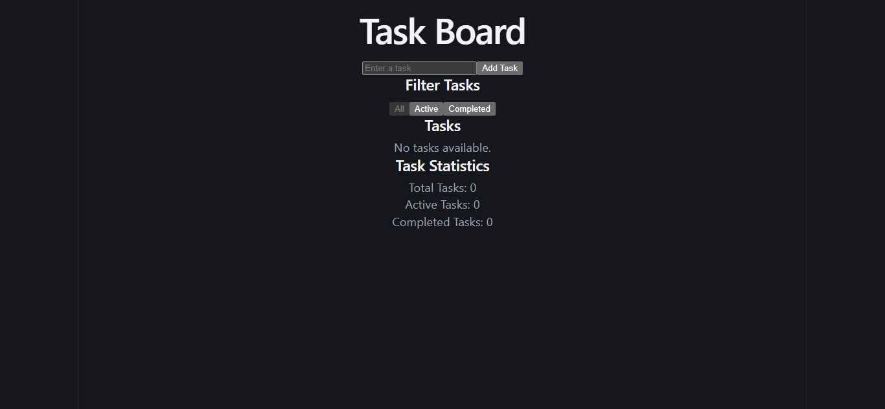

# React Task Board

A single-page interactive Task Board built with **React, TypeScript, and Vite** as part of the Coding Pixel Full-Stack Internship Program – Week 3.

## Screenshot



## Features

- Add new tasks
- Reject empty or whitespace-only task titles
- Trim whitespace from task titles
- Mark tasks as completed or active
- Delete tasks
- Filter tasks by All, Active, and Completed
- Display total, active, and completed task counts
- Immutable state updates using `spread`, `map()`, and `filter()`
- Stable React list keys using task IDs
- Responsive user interface

## Technologies Used

- React
- TypeScript
- Vite
- HTML
- CSS
- npm

## Project Structure

```text
react-task-board/
├── screenshots/
│   └── task-board.png
├── src/
│   ├── components/
│   │   ├── FilterBar.tsx
│   │   ├── TaskInput.tsx
│   │   ├── TaskItem.tsx
│   │   └── TaskList.tsx
│   ├── App.tsx
│   ├── App.css
│   ├── index.css
│   └── main.tsx
├── public/
├── package.json
├── tsconfig.json
├── vite.config.ts
├── eslint.config.js
└── README.md
```

## Components

### App

The main parent component that manages:

- Task state
- Current filter
- Adding tasks
- Toggling tasks
- Deleting tasks
- Filtering tasks
- Task statistics

### TaskInput

Handles the controlled task input and adding new tasks.

### FilterBar

Allows users to filter tasks by:

- All
- Active
- Completed

### TaskList

Displays the list of tasks and renders `TaskItem` components.

### TaskItem

Displays an individual task with options to toggle completion and delete the task.

## Data Model

```typescript
type Task = {
  id: string;
  title: string;
  completed: boolean;
  createdAt: number;
};

type Filter = "all" | "active" | "completed";
```

## React Concepts Practiced

- React Components
- JSX
- TypeScript with React
- Props
- `useState`
- Event handling
- Controlled inputs
- Conditional rendering
- `.map()`
- `.filter()`
- Immutable state updates
- Stable React keys
- Lifting state up
- Component composition

## State Management

All task state is stored in the `App` component.

Data flows down through props, while child components communicate with the parent through callback functions.

```text
App
├── TaskInput
├── FilterBar
└── TaskList
    └── TaskItem
```

## Installation

Install the project dependencies:

```bash
npm install
```

## Run the Project

Start the development server:

```bash
npm run dev
```

Open the local URL shown in the terminal.

## Run ESLint

```bash
npm run lint
```

## Build the Project

```bash
npm run build
```

## Week 3 Acceptance Criteria

- [x] Built with Vite, React, and TypeScript
- [x] Five required components are present
- [x] Components use typed props
- [x] Task input is controlled
- [x] Empty and whitespace-only tasks are rejected
- [x] Tasks can be added
- [x] Tasks can be toggled
- [x] Tasks can be deleted
- [x] All, Active, and Completed filters work
- [x] Task counts update correctly
- [x] State updates are immutable
- [x] `spread`, `map()`, and `filter()` are used
- [x] No direct task mutation
- [x] Stable task IDs are used as React keys
- [x] State is managed in `App`
- [x] Props and callbacks demonstrate lifting state up
- [x] Project builds successfully
- [x] ESLint passes without errors

## Internship

**Coding Pixel Full-Stack Internship Program**

**Week 3 – React Fundamentals**

## Author

**Muhammad Haris**

GitHub: `hariskhan-136`
